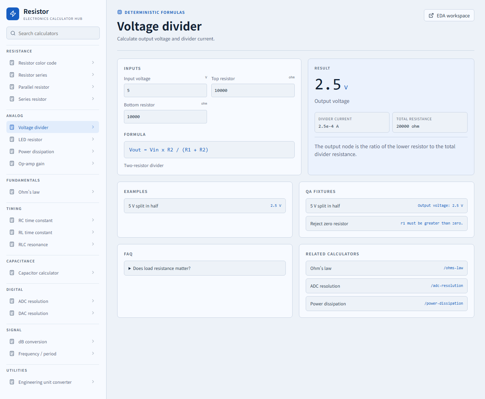
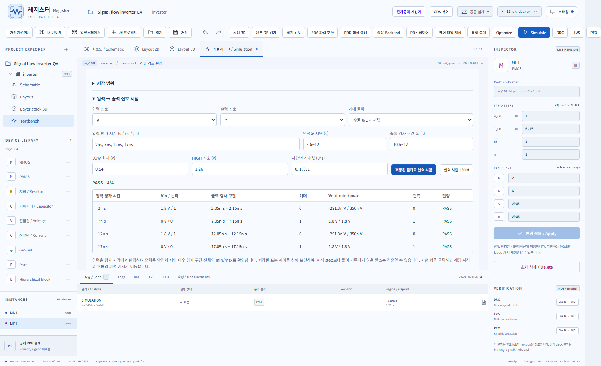

# Resistor · 레지스터 / Register

전자공학 계산기와 회로·레이아웃·시뮬레이션을 연결하는 오픈소스 작업공간입니다.
계산은 결정적인 수학 로직으로 수행하며, EDA 결과는 실제 해석 엔진의 수치와
설계 revision을 함께 표시합니다. A deterministic electronics calculator hub and
integrated schematic, layout, waveform and 3D inspection workspace.

[기여 방법](CONTRIBUTING.md) · [변경 기록](CHANGELOG.md) ·
[구조](docs/architecture.md) · [공개 소스 범위](docs/open-source.md) ·
[MIT 라이선스](LICENSE) · [외부 구성요소 고지](docs/THIRD-PARTY-NOTICES.md)

## 소스에서 시작하기

Node.js 24와 Git이 필요합니다. 계산기 화면은 Docker 없이 실행할 수 있습니다.

```sh
git clone https://github.com/Lead729726-cell/Resistor.git
cd Resistor
npm ci
npm run dev:calculators
```

브라우저에서 http://127.0.0.1:5173 을 여세요. EDA 설계·해석에는 Linux 컨테이너를
실행하는 Docker가 필요합니다. `npm run doctor`로 설치를 확인하고
`npm run dev:web`으로 웹 EDA, `npm run dev`로 Electron 앱을 실행합니다.
첫 엔진 이미지 다운로드에는 시간과 저장 공간이 필요합니다.
[설치 안내와 Mac 검증 범위](docs/desktop-installation.md)를 확인하세요.

고정된 공개 데모 주소는 아직 없습니다. 임시 다운로드 주소는 영구 링크로 사용하지 않습니다.




## 구조와 검증

| 경로 | 역할 |
| --- | --- |
| `packages/calculators` | 공식, 단위 변환, 예제 및 입력 검증 |
| `packages/ui`, `apps/web`, `apps/desktop` | 공통 웹 화면과 Electron 앱 |
| `packages/analysis`, `packages/viewer` | 파형·전압/전류 검사와 2D/3D 표시 |
| `workers/eda`, `adapters` | 실제 EDA 엔진, PDK 및 파일 호환 |
| `platform/cloud` | 권한·revision을 검사하는 공동 작업 서버 |
| `tests`, `docs/evidence`, `examples` | 자동 검사, 조건별 기록 및 설계 예제 |

```sh
npm run test:core
npm run typecheck
npm run build
npm run audit:source
npm run check:docs
```

GitHub CI는 엔진 없이 실행하는 공통 검사를 수행합니다. 실제 ngspice·DRC·LVS·PEX,
브라우저 동작과 Mac 앱 검사는 별도의 환경이 필요합니다. 구현과 검증의 범위는
[현재 상태](docs/implementation-status.md), [시험 안내](CONTRIBUTING.md),
[전압·전류 흐름 시험](docs/signal-flow.md)에 기록합니다.

기존 EDA는 `/eda`에서 사용할 수 있습니다. 시뮬레이션 결과의 **Waveform lab**은
A/B 커서·구간 통계·RMS·적분, 전이 시간·지연, 전압/전류 연산과 전력·에너지,
출처를 포함한 CSV/JSON 저장을 제공합니다.
[공식과 사용법](docs/waveform-lab.md) · [수치 검사](tests/waveform-analysis.test.ts).

## Electronic Engineering Calculator Hub

Resistor는 전자공학에서 반복되는 계산을 빠르고 정확하게 수행하는 오픈소스
engineering utility hub로 확장 중입니다. 루트 웹 화면은 회원가입 없이 바로 쓰는
계산기 허브이며, 기존 EDA 작업공간은 `/eda`에서 유지합니다.

현재 계산기 허브는 다음 표준 구조를 공유합니다.

- Inputs: 명확한 label과 SI 단위 입력
- Formula: 사용 공식과 reference equation 표시
- Result: 주요 결과를 가장 크게 표시
- Explanation: 결과의 의미를 짧게 설명
- Validation: 0, 음수, 불가능한 전압 등 invalid input 차단
- Examples: 실제 engineering 예제와 QA fixture 공유

지원 계산기:

- resistor color code, resistor series, series/parallel resistance
- voltage divider, LED resistor, power dissipation, Ohm's law
- RC, RL, RLC, capacitor calculator
- ADC/DAC resolution, op-amp gain, dB conversion
- frequency/period, engineering unit converter

공식 코어는 `packages/calculators/src/index.ts`에 있고, QA는
`tests/formulas/`에서 reference equation, known values, edge cases, unit conversion
fixture를 검증합니다.

```powershell
npm run test:formulas
npm run build
```

## v0.14 · Apple Silicon과 Intel Mac 지원

두 Mac CPU용 앱/ZIP 생성 경로, Finder에서 Docker 탐색, Mac 메뉴와 ⌘ 단축키,
앱 외부 저장 폴더 및 기존 파일 보존을 추가했습니다. 실제 Mac의 offline viewer
검증과 선택 가능한 5단계 native EDA 검증을 준비했습니다.
Mac 바이너리/ZIP 구조 검증은 실제 Mac 실행·서명·공증을 대신하지 않습니다.
[설치 방법과 플랫폼별 검증 범위](docs/desktop-installation.md)를 확인하세요.

## v0.13 · 실제 검증 흐름과 설치 진단

`통합 설계 → 회로 → 물리 검증`에서 회로 해석·DRC·LVS·PEX·RC 포함 해석을
순서대로 실행합니다. 실패·취소·설계 변경이 있으면 다음 단계를 중단하고, 실제
run ID와 조건을 담은 검증 기록을 저장합니다. 전가산기의 5단계 native 실행과
pre/post 8개 입력을 앱 화면에서 확인했습니다.

Docker 누락·Linux engine·workspace 연결·인증 상태를 진단하고 재연결하거나
독립 GDS 뷰어를 열 수 있습니다. [검증·설치 진단·Mac 준비](docs/validation-workflow.md).
Windows 설치본은 `release/installers/Register-0.13.0-win-x64.exe`, 별도 실행본은
`release/0.13.0/Register-win32-x64/Register.exe`입니다. 서명되지 않은 개발 설치본입니다.
Mac의 `.app`·DMG 생성 및 실제 뷰어/시작 진단 검사는 Mac에서 실행하는 workflow를
준비했습니다. 실제 Mac 실행·서명·공증과 상용 vendor 도구 실행은 아직 미검증입니다.

가산기·작은 CPU·계층 복사/영향 미리보기/승인/Undo·Redo 및 녹화는
[직접 만든 설계와 작업 기록](examples/cpu4/README.md)에 있습니다.
배선 저항/용량을 포함한 CPU 결과는 회로 해석 결과와 조건을 구분해 공개합니다.
이전 0.12 대형 작업물은 로컬 `examples/history/`에 보존하며 소스 Git에서는 제외합니다.
소스 공개와 서비스 인터넷 배포는 별도로 진행합니다.

2026-10-02 개발 추가: **내 반도체 → 미리 만들어보는 내 반도체**에서 CMOS·MOS 특성·
MUX4·전류 기준·차동 센서·증폭기·신호 필터 8개 시작 설계와 운전 조건을 선택합니다.
회로·지원 물리 레이아웃·testbench를 함께 저장하고 실제 해석을 실행합니다.
SKY130은 시작 설계에 연결되어 있고 GF180·IHP는 공정 특징 비교용입니다.
[시작 설계 사용법과 실제 검증](docs/semiconductor-starters.md).

2026-10-02 개발 추가: 프로그램을 직접 사용해 공개 SKY130 **4:1 MUX**를 제작했습니다.
20개 MOS·물리 배선, 실제 64개 진리표, DRC/LVS/PEX, pre/post 해석과 전류 뷰어를
연결했습니다. 20ns 기본/느린 조건은 pre/post 64/64, 5ns post-layout은 56/64 실패를
보존했습니다. [설계 파일·직접 사용 검증·한계](examples/mux4/README.md).
현재 0.13 Windows 설치본에 포함되어 있습니다.

## v0.11 · 공정 시퀀스 실행

공정 3D에서 속도 기반 3D 증착·식각·CMP를 순서대로 계산합니다. Conformal/방향성
증착, ray 가림·국부 단일 재방출, 재료별 선택적 isotropic/방향성 식각, Preston/plane
CMP, GDS polygon/hole mask, 초기 tetra 결과 재사용, h·2h 비교와 평면 측정 속도 fit을
지원합니다. 단계별 공극/체적/표면 높이, 모든 시작 표면의 피복/미해결 박막과
전체 history·표준 VTU를 저장하고 다시 읽습니다.
Node 서버 엔진과 Windows 패키지를 포함합니다. 속도 기반 형상 계산이며 보정된 장비
화학·소자 coupled TCAD 및 foundry signoff와 구분합니다.
[설정·모델·한계·CLI 사용법](docs/process-simulation.md).

공개 SKY130 PDK를 실제 ngspice·KLayout·Magic·Netgen·Xschem에 연결하는 회로/레이아웃 설계 프로그램입니다. Windows 데스크톱, 브라우저, Linux 공동 작업 서버를 제공합니다. 정수 DBU 원본과 3D 표시 높이를 구분합니다.

v0.10: **공정 3D**에서 위치별 XYZ 체적·국부 두께를 읽고 소자·홀·단차 및 다층
금속/절연막을 검토합니다. 재료별 기준, XYZ 단면, 전량 두께/피복 검사, 명시된
공극 연결성, 위험 위치 선택과 JSON/CSV/PNG 및 portable bundle을 제공합니다.
교육 예제와 실측/해석 입력을 구별하며 공정 물리 예측을 실행한 것으로 표시하지
않습니다. [공정 3D 검토 사용법과 범위](docs/process-topography.md).

v0.9: 새로운 **회로형 R 로고**와 **스타일** 설정을 제공합니다. 다크·라이트·시스템
모드와 그래파이트·제이드·코퍼·아이리스 4개 스킨을 설계 화면, 독립 뷰어, 설정 패널,
파형 및 3D 배경에 적용하고 선택을 자동 저장합니다. [화면 스타일 사용법](docs/appearance.md).

v0.3: **Start-Viewer.cmd** 또는 `Register.exe --viewer`로 Docker와 로그인 없이
GDS만 열 수 있습니다. `.lyp` / JSON PDK layer와 공개 SKY130 표시 profile을 적용하고,
실제 OP/DC/transient의 전류 방향·벡터·수치를 뷰어에서 확인합니다.
[GDS / PDK / 전류 사용법](docs/viewer-current.md)에 파일 형식과 대응 범위가 있습니다.

v0.4: **PDK·해석 설정**에서 기술·모델 profile 입력, 실제 GDS 추출 포트 검사,
접지·전원·공정 코너·해석 조건 저장과 실행을 연결합니다. 설치 PDK 경로 또는
manifest/ZIP를 입력하고 각 리소스와 해시를 검사합니다.
[PDK 설정 절차](docs/pdk-setup.md)에 필요한 입력과 호환 범위가 있습니다.

v0.5: **상용 Backend**에서 Virtuoso·Custom Compiler·Assura·IC Compiler 계열 등
17개 상용 도구의 native recipe를 등록하고 로컬 또는 별도 인증 에이전트에서 실행합니다.
설정·로그·취소·출력 다운로드·GDS/OAS 반입과 전류 결과 표시를 연결했습니다.
현재 상용 도구는 설치되지 않았으며 실제 vendor 실행은 미검증입니다.
[설치 후 연결 절차](docs/commercial-backends.md)에 버전별 설정과 결과 형식이 있습니다.

v0.6: **EDA 파일 호환**에서 실제 GDS/OAS·LEF/DEF, Cadence ASCII 기술/표시·stream map,
라이브러리 정의, CDL/SPICE와 외부 해석 결과를 가져옵니다. 도구 연결 설정과 별도로
레이어·회로 metadata를 읽고 native 설계를 반입/내보내며 signed 전류를 표시합니다.
[파일 호환 절차와 범위](docs/eda-interchange.md)에 형식별 구현과 검증 범위가 있습니다.

v0.7: **원본 DB 읽기**에서 고정된 native API query와 실제 source/cell/view 진단,
불변 graph receipt, 원본 무변경/해시 검사 및 새 revision 반입을 제공합니다.
상용 실행 파일·SDK는 아직 없으므로 실제 vendor 실행은 미검증입니다.
**설계 검토**에는 도형/net/cell 검색, 정수 거리 측정, 북마크, 범위가 명시된 Scene
변경 비교, signed 전류/파형 CSV가 있습니다.
[원본 DB 절차](docs/native-database.md) · [설계 검토 사용법](docs/design-review.md) ·
[추가 개발 목록](docs/development-roadmap.md).

v0.8: **통합 설계**에서 실제 전원 연결을 선택해 PVT 조건표를 저장하고,
조건별 ngspice 결과·최악 조건·제약과 로그를 비교합니다. PDK 규칙과 원본 도형을
확인하는 Manhattan 배선 미리보기/적용, 연결된 아날로그 회로 템플릿과 실제
pin/net 연결 탐색을 제공합니다. 회로 템플릿의 미생성 레이아웃, 부분 연결 정보,
물리 검증 결과를 구분합니다. [통합 설계 절차](docs/integrated-design.md).

## 실행

설계·해석에는 Docker Desktop을 Linux containers 모드로 실행한 뒤 **Start-Register.cmd** 또는 **release/0.13.0/Register-win32-x64/Register.exe**를 실행합니다. 기존 `.runtime/eda` 작업은 보존됩니다. 앱은 첫 설계 요청에서 전용 EDA worker와 공동 작업 허브를 시작합니다. 독립 뷰어는 해당 서비스를 시작하지 않습니다.

```powershell
cd Resistor
npm ci
npm run doctor
npm run dev
```

브라우저 개발은 `npm run dev:web` → http://127.0.0.1:5173, 협업 허브는 `npm run cloud:start` → http://127.0.0.1:18766 입니다. 빌드/패키지는 `npm run build`, `npm run package`입니다.

## 구현 기능

- 회로도: 소자·배선·접점·계층 블록·pin/net 편집, SPICE 및 실제 Xschem 생성 netlist, testbench.
- 레이아웃: box·polygon/holes·path·label·pin·cell·instance/array·회전/반사·복사·이동·삭제·undo/redo·공개 via helper, GDS/OASIS 및 immutable bundle.
- 2D/3D: 같은 stable ID, visibility/lock/projection/explode, holes를 유지하는 절단면, hierarchy focus, PNG/GLB 표시용 export, 정확한 영역 제한 표시.
- 실제 해석: DC/AC/OP/tran, TT/FF/SS·온도·전압 설정, 독립 DRC/LVS/PEX/post-layout, 로그·raw·파형·측정·전후 비교·STALE.
- [전압·전류 흐름 및 신호 시험](docs/signal-flow.md): 실제 넷 전압·signed 단자 전류·ΔV 재생, 입력→출력 논리/아날로그 구간 PASS/FAIL, 출처를 포함한 JSON.
- 공개 예제: MOSFET, CMOS 인버터, 배선, 전류 미러, 차동쌍. 각 physical template의 검증은 개별 기록됩니다.
- 최적화: seeded grid/random/TPE, 후보별 실제 PCell→DRC→LVS→ngspice, feasible-only 점수, trial/시간/동시 실행 상한, 취소 및 후보 비교.
- 공동 작업: 계정/권한/초대, 실제 설계 복제와 동시 편집, 충돌 보존 및 중복 명령의 1회 처리, 선택/커서/revision/job 공유, 실제 파일 업로드/다운로드, 후보 복사.

공동 작업 패널에서 가입/로그인하고 현재 프로젝트를 공유하거나 새 공유 설계를 만든 뒤 Editor/Viewer를 초대합니다. 원격 모드에서 편집은 서버 권한/revision 검사를 거칩니다. 로컬 원본은 유지합니다. 자세한 Linux/HTTPS/영구 볼륨/백업 구성은 [서버 안내](docs/cloud.md)에 있습니다. 유료 Supabase 생성은 사용자가 보류했으며 인터넷 호스팅은 아직 개설하지 않았습니다.

## 검증과 AI 연동

```powershell
npm test
npm run test:viewer
npm run test:importer
npm run test:pdk
npm run test:pdk-cloud
npm run test:pdk-backup
npm run test:backend
npm run test:backend-cloud
npm run test:interchange
npm run test:interchange-cloud
npm run test:database
npm run test:database-cloud
npm run test:pvt
npm run test:design-tools
npm run test:integrated-cloud
npm run test:cloud
npm run test:mcp
npm run test:integration
node tests/integration/physics.mjs
node tests/integration/native-extended.mjs
node tests/integration/extensions.mjs
node tests/integration/optimizer.mjs
npm run test:ui
```

실제 engine 테스트는 Docker worker가 필요합니다. UI 검증은 패키지 및 개발 서버를 사용합니다. 증거는 `docs/evidence`와 `packages/viewer/tests/evidence`에 있습니다. [AI/MCP 도구](docs/agent-integration.md)는 실제 typed transaction/job/experiment를 노출하고 외부 유료 AI API를 호출하지 않습니다.

[구현 상태 및 제약](docs/implementation-status.md) · [검증](docs/verification.md) · [구조](docs/architecture.md) · [PDK](docs/pdk-integration.md) · [라이선스](docs/THIRD-PARTY-NOTICES.md)
