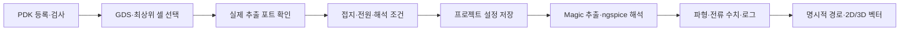

# PDK 등록과 GDS 해석 설정

레지스터의 **PDK·해석 설정**은 기술 라이브러리 선택, 레이아웃 연결, 포트와
전원 지정, 해석 조건 저장, 실제 엔진 실행을 한 절차로 연결합니다.
PDK 모델과 추출 규칙을 연결하면 GDS에서 실제 회로 넷리스트를 추출하고
바이어스 조건으로 전류를 계산할 수 있습니다. 모델·포트·조건을 GDS만으로
추측하지 않습니다.



## 기본 SKY130 사용

1. 설계 작업공간 또는 독립 GDS 뷰어에서 **PDK·해석 설정**을 엽니다.
2. 설치된 공개 `sky130A`를 선택하고 **실제 PDK 리소스 검증**을 실행합니다.
3. GDS와 최상위 셀을 선택하고 엔진에 가져옵니다. 독립 뷰어에서는 별도
   프로젝트를 만들며, 기존 파일과 프로젝트를 덮어쓰지 않습니다.
4. **실제 GDS 추출 포트 검사**로 Magic이 실제로 추출한 최상위 `.subckt` 포트를 확인합니다.
5. 각 포트의 역할과 값을 지정합니다. 접지, DC 전압원, 떠 있는 포트를
   구분합니다. 소자의 동작 조건에 맞춰 모든 포트를 검토해야 합니다.
6. 공정 코너, 온도, OP/DC/transient, DC sweep 포트 또는 시간 간격,
   기생성분 포함 여부를 설정하고 저장합니다.
7. 시뮬레이션 또는 DRC/PEX/LVS를 실행합니다. LVS에는 대응하는 회로
   reference SPICE가 필요합니다. 실행 실패·회로 불일치와 성공은 별도로 표시합니다.
8. 실제 전류 결과를 확인합니다. 임의 GDS에서 위치 대응이 없는 가지는
   수치로 표시하며, 사용자가 지정하고 확인한 DBU 경로에만 화살표를 그립니다.

OP는 지정한 DC 바이어스의 정상 상태입니다. DC는 선택한 전압원의 sweep,
transient는 설정한 바이어스와 시간 조건에 대한 해석입니다. 자동으로 입력
파형을 만들어 회로의 실제 입력이라고 표시하지 않습니다.

## 다른 PDK 또는 모델 입력

설치된 PDK는 worker의 `/foss/pdks` 안의 경로로 등록할 수 있습니다.
사용자 파일은 JSON manifest와 ZIP 패키지로 입력합니다. Windows 경로를
Linux worker 경로로 간주하지 않습니다. ZIP 안의 상대 경로는 관리되는
패키지 디렉터리에 연결합니다.

입력 항목은 profile ID·이름·버전, 모델 파일, `.lib` 또는 `.include` 방식,
공정 코너, SPICE geometry scale, Magic RC/technology, Netgen setup,
선택적 레이어 파일입니다. `.lib`는 선택한 코너를 model deck에 연결합니다.
근거: [ngspice 공식 매뉴얼](https://ngspice.sourceforge.io/docs/ngspice-manual.pdf).

예를 들어 ZIP 안에 실제 호환 파일을 다음 상대 경로로 배치한다면 manifest는
아래처럼 입력합니다. 파일 이름은 사용자의 PDK에 맞춰 바꾸고, `tt`가 모델의
실제 `.lib tt` section인지 확인합니다. 이 예시는 모델 데이터를 포함하지 않습니다.

```json
{
  "schema_version": 1,
  "id": "my-process-v1",
  "name": "My process",
  "version": "1.0",
  "root": "",
  "model_file": "models/process.lib",
  "model_mode": "lib",
  "corners": ["tt"],
  "spice_scale": 0.000001,
  "magic_tech": "technology/process.tech",
  "layer_file": "display/process.lyp"
}
```

LVS를 사용하려면 호환 `netgen_setup`도 연결합니다. `spice_scale`은 모델과
추출된 W/L·좌표의 단위에 맞춰 지정하며, 레이어 palette의 DBU와 별개입니다.
`.include`는 이 설정에서 코너 한 개의 모델 deck을 뜻합니다. OP/DC/transient
실행에는 해당 모델과 추출 technology가 있어야 합니다.

레이어 색상만으로 소자나 전류가 계산되지는 않습니다. 해석에는 모델과
해당 GDS를 읽을 수 있는 추출 technology가 모두 필요합니다. 공개 SKY130은
검증된 기본 adapter를 사용하며, 추가 입력은 ngspice/Magic/Netgen에 맞는
리소스를 요구합니다. Cadence/Synopsys의 전용 모델·PCell·검증 도구는 해당
라이선스와 별도 backend가 필요합니다.

사용자 SPICE는 포함 파일까지 검사하고 해시를 기록합니다. 임의 Tcl 실행이
필요한 업로드 덱은 자동으로 활성화하지 않으며, 지원하는 설치 덱과 정확히
일치하는 경우에 한해 연결합니다. 지원하지 않는 리소스는 검사 결과에 이유를
표시합니다. 실제 engine 호환성 및 회로 수렴은 개별 실행 결과로 확인합니다.

## 저장·공동 작업·복구

설정은 프로젝트 revision에 저장합니다. PDK 버전 및 리소스 해시를 고정하고,
파일이 바뀌면 기존 결과를 STALE로 판정합니다. 저장된 설정 JSON은 모델
바이너리를 포함하지 않습니다. 독립 뷰어에서 엔진을 사용하지 않고 GDS를
탐색하는 기능은 유지합니다.

공동 설계에서는 서버에 설치된 profile을 선택합니다. Editor/Owner가 설정과
해석을 실행하며 Viewer는 결과를 읽습니다. 설정 충돌은 프로젝트 revision과
명령 receipt로 검사합니다. 서버 PDK 설치는 운영자가 수행합니다.

기본 온라인 백업은 PDK registry metadata를 데이터베이스와 함께 보존합니다.
업로드한 모델 파일도 복구하려면 운영자가 다음 옵션으로 백업합니다.

```powershell
npm run cloud:backup -- --include-managed-pdks
```

이 옵션은 앱이 관리하는 업로드 PDK 파일과 SHA256을 포함합니다. 설치된
시스템 PDK와 worker 인증 토큰은 포함하지 않습니다. 백업은 비공개로
보관하고 해당 PDK의 이용·복제 조건을 따릅니다. 다른 서버로 복구할 때는
설치 경로와 리소스 해시를 다시 검사해야 합니다.

관련 안내: [독립 뷰어와 전류](viewer-current.md), [서버 구성](cloud.md),
[검증 기록](verification.md).
