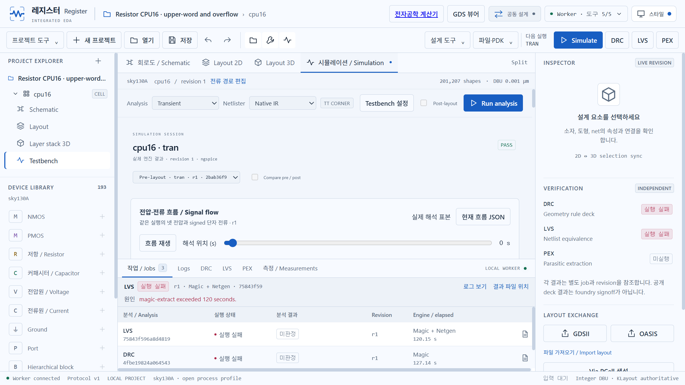

# CPU16 · 실제 작업대에서 만든 16비트 참조 프로세서

레지스터 v0.16의 프로젝트 도구 → 가산기·CPU에서 직접 생성했습니다.
16비트 ACC와 ALU, 4비트 PC, 16×18비트 ROM, Carry/Zero 및 동기 리셋을 갖습니다.
LOAD/ADD/AND/XOR를 실행하며 15번 명령 다음에는 0번으로 순환합니다.
RAM·분기·인터럽트·범용 소프트웨어 ISA와 제조 승인은 포함하지 않습니다.

## 열고 검사하기

1. [설치 파일](https://resistor-downloads.vercel.app)을 받거나 소스에서 실행합니다.
2. 프로젝트 도구 → 워크스페이스에서 [cpu16.register.zip](cpu16.register.zip)을 가져옵니다.
3. 회로도에서 ADD16·ROM16·ACC 레지스터의 하위 셀을 열어 편집할 수 있습니다.
4. Simulation에서 저장된 TT·27°C·1.8V·100ns 조건으로 실제 해석을 실행합니다.
5. DRC·LVS·PEX는 현재 설계에서 별도로 실행합니다. 불완전한 검사는 PASS가 아닙니다.

번들 가져오기는 새 프로젝트를 만들며 과거 실행 기록을 PASS로 재사용하지 않습니다.
실제 번들 재개방에서 정수 기하 해시와 계층을 보존했고 새 프로젝트의 runs는 0개였습니다.
[GDSII](cpu16.gds), [OASIS](cpu16.oas), [참조 SPICE](cpu16.spice)도 제공합니다.
SPICE는 하위 회로이며 별도의 SKY130 모델과 clock/reset/VDD testbench가 필요합니다.

## 실제 전기 해석

펼친 회로는 SKY130 MOS 2,354개이며 행동 전압원으로 계산 결과를 만들어 넣지 않습니다.
명령·입력·PC·ACC15까지의 전체 출력·Carry/Zero와 안정 구간을 실제 ngspice 파형으로 검사했습니다.

- TT / 27°C / 1.8 V / 5 fF / 100 ns / 32 cycles / 총 관측 3.5 µs.
- 실제 pre-layout 32/32 통과, 리셋 확인, ROM 두 번 순환, 5,733개 샘플.
- 65,535 + 1 → ACC 0, Carry 1, Zero 1을 관측했습니다.
- 실제 VDD 전류의 부호 있는 적분: 평균 20.010 µA, 평균 36.019 µW, 에너지 126.065 pJ.
- 전력과 안정 시점은 이 testbench의 관측값이며 STA나 실제 칩 성능을 보장하지 않습니다.
- 전체 참조 배치 201,207개 shape를 잘림 없이 읽었습니다. 넓은 참조 배치이며 면적 최적화 배치가 아닙니다.

독립 검사에서는 16비트 가산기 70개 지정 입력, 계층으로 감싼 CPU16, 기존 CPU4,
입력 범위와 훼손된 상위 비트 파형 거부를 확인했습니다.
[8개 native 검사 기록](../../docs/evidence/cpu16-native.json).
가산기의 70개 검사는 walking bit·carry chain·경계값 검사이며 2³³ 조합의 전수 검사는 아닙니다.

실제 job·조건·32행 결과·기하 해시·파일 SHA-256과 물리 검증 상태는
[native-evidence.json](native-evidence.json)에 저장했습니다. 최초 DRC와 LVS는
120초 제한으로 실패했고 해당 기록을 보존했습니다. CPU16의 물리 엔진 제한은
각 명령당 600초로 조정한 후 재실행에서 DRC는 286.07초, 위반 0개로 통과했고 LVS는 293.18초, circuits match uniquely로 통과했습니다. PEX와 post-layout 실행은 이번 예제에서 수행하지 않았습니다.

## 화면과 작업 기록

실제 브라우저 조작 화면의 시각별 프레임을 보존했습니다. 코드를 편집하는 터미널은
촬영하지 않았으며 연속 30fps 영상이 아닙니다. [작업 화면 녹화](workflow.webm)와 [시각별 수집 범위](recording.json)를 확인하세요.
