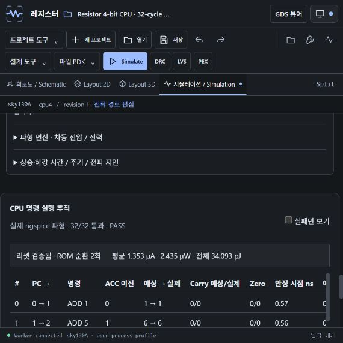
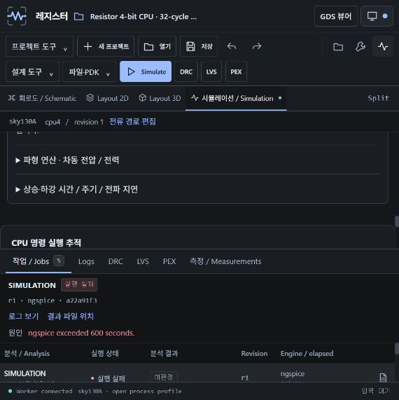
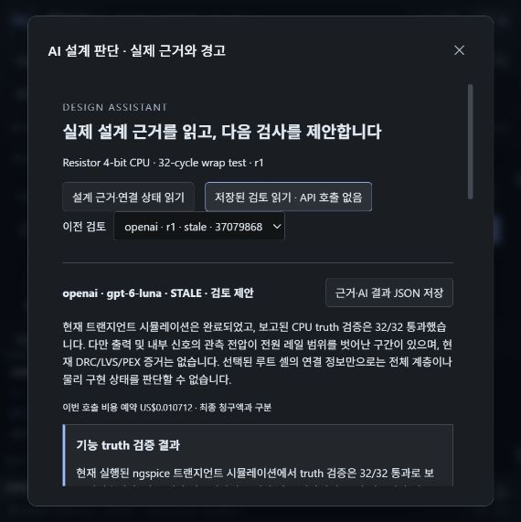

# 4-bit CPU · actual tool session (v0.15)

2026-10-07에 레지스터의 **디지털·계층 작업대**를 직접 조작하여 만든 참조 CPU입니다.
기존 LOAD/ADD/AND/XOR 트랜지스터 CPU 템플릿의 ROM을 변경하고, 32회 실행과
실제 물리 배치를 생성했습니다. 범용 상용 프로세서나 제조 승인 설계는 아닙니다.

## 재현

1. `npm ci` 후 `npm run dev`로 로컬 작업대를 엽니다. Docker의 공개 SKY130 엔진이 필요합니다.
2. 프로젝트 도구의 프로젝트 번들 가져오기에서 [cpu4.register.zip](cpu4.register.zip)을 선택합니다.
3. 프로젝트 이름과 revision을 확인한 뒤 Simulation에서 실제 pre-layout 분석을 실행합니다.
4. DRC → LVS → PEX를 각각 실행하여 현재 설계 결과를 확인합니다. `Post-layout`은 별도 실행입니다.
5. 설계 도구 → AI 설계 판단에서 근거를 읽고, 제공자를 선택하고 한 번의 호출을 승인합니다.
   키·Ollama·호출 한도는 [로컬 설정 문서](../../docs/design-assistant.md)를 따릅니다.

번들은 설계와 PDK lock을 포함하며 실행 기록은 포함하지 않습니다. 가져온 새 프로젝트에서는
기존 결과를 PASS로 재사용하지 않고 직접 다시 실행합니다. [GDS](cpu4.gds),
[OASIS](cpu4.oas), [참조 SPICE subcircuit](cpu4.spice)도 제공합니다. GDS/OAS 저장·재열기에서
정수 기하, 계층, 안정 ID의 동일성을 실제 확인했습니다. SPICE 파일은 하위 회로이며
독립 시뮬레이션에는 공개 PDK 모델과 reset/clock/VDD 부하 testbench가 필요합니다.

## 설계와 실제 결과

- 4-bit accumulator, 4-bit PC, 16 × 6-bit ROM, Carry/Zero, LOAD/ADD/AND/XOR.
- ROM: ADD 1, ADD 5, ADD 9, XOR 10, AND 7, LOAD 15, ADD 1, ADD 15,
  AND 6, XOR 15, LOAD 0, ADD 7, ADD 8, XOR 5, AND 10, XOR 15.
- SKY130 TT, 27°C, 1.8 V, 5 fF, clock period 400 ns, 32 cycles, 14 µs.
- 생성된 전체 물리 장면: 73,860 shapes. 배치는 기존 flat transistor reference 범위입니다.

| 실제 실행 | 상태 | 관측 결과 |
| --- | --- | --- |
| ngspice pre-layout | 완료 / PASS | 32/32, reset 확인, ROM wrap 2회, 5,357 samples |
| Magic DRC(full) | 완료 / PASS | 선택 공개 deck의 위반 rectangle 0개; signoff 아님 |
| Netgen LVS | 완료 / PASS | circuits match uniquely |
| Magic PEX | 완료 / PASS | 64,728 R / 28,302 C |
| ngspice post-layout | 실행 실패 / 미판정 | ngspice 600초 제한; 전체 job 645.39초, truth 결과 없음 |

Pre-layout 실제 VDD 전류의 부호 있는 사다리꼴 적분: 평균 1.353 µA, 평균 2.435 µW,
전체 에너지 34.093 pJ. 명령별 ACC/PC/Carry/Zero 안정 구간과 전류·에너지 값을 볼 수 있습니다.
관측 settling upper bound는 약 0.43–0.62 ns이며, 샘플 기반 수치이고 STA 결과가 아닙니다.
기생 성분 포함 결과는 시간 초과했으므로 해당 값으로 post-layout 동작·전력을 추정하지 않습니다.

실제 run ID, 조건, 상세 32행, 원본 소스 해시는 [native-evidence.json](native-evidence.json)에 있습니다.
위 시간 초과는 다음 최적화 대상으로 남아 있습니다: 실제 RC와 출력 파형을 보존하면서
solver 실행 시간·메모리를 줄이고, 짧은 물리 실행 및 32-cycle 결과를 다시 비교해야 합니다.

## AI 검토와 녹화

[Ollama 검토](ollama-review.json)는 로컬 qwen2.5:1.5b의 실제 응답입니다.
작은 모델은 한국어 지시에도 주로 영어로 응답했으므로 품질 한계가 있습니다.
[OpenAI 검토](openai-review.json)는 gpt-6-luna의 실제 응답이며 기능 검사와
rail overshoot, 누락된 당시 물리 검증 증거를 구분했습니다. 두 응답은 **pre-layout만 끝난 시점**의
근거를 사용했습니다. 이후 DRC/LVS/PEX와 실패한 post-layout 실행이 추가되어 저장 검토는
`STALE`로 표시됩니다. AI는 설계를 수정하거나 엔진 검사를 실행하지 않습니다.

이번 작업에 승인된 API 한도는 US$1이며, 실제 OpenAI 요청은 1회입니다.
서버가 예약한 보수적 상한은 US$0.010712, 남은 예약 한도는 US$0.989288입니다.
이는 최종 청구서 금액이 아닙니다. 키·로컬 예산·모델·사용자 DB는 이 예제에 포함되지 않습니다.

[실제 브라우저 작업 녹화](workflow.webm)는 CPU 설정부터 물리 배치·검증, 두 제공자 검토,
근거 변경 표시와 시간 초과까지의 화면 기록입니다. 터미널·코드 편집은 녹화되지 않았습니다.
수집된 33개 CDP 화면 프레임의 실제 시각을 유지하여 중간 정지 화면을 재생합니다.
연속 30fps 영상이 아닙니다. [녹화 메타데이터](recording.json)에 구간과 인코딩 검사 범위를 기록했습니다.

## 추가 기능 검증

- 핵심 Node/TypeScript 150/150, 실제 엔진 확장 7/7, 배선·설계 회귀 27/27.
- 실제 MCP 41개 도구 통합 1/1, cloud 권한 통합 1/1, AI/배선 desktop/mobile UI 2/2.
- [실제 엔진 확장](../../docs/evidence/assistant-extensions.json),
  [UI 실행 기록](../../docs/evidence/assistant-ui/playwright.json),
  [우회 배선 화면](../../docs/evidence/assistant-ui/detour-desktop.png).
- M1 arm64 v0.15 ZIP 구조·13개 Mach-O·14개 symlink·번들 해시 검사는 통과했습니다.
  macOS 직접 실행, Developer ID 서명, notarization은 아직 확인하지 않았습니다.
