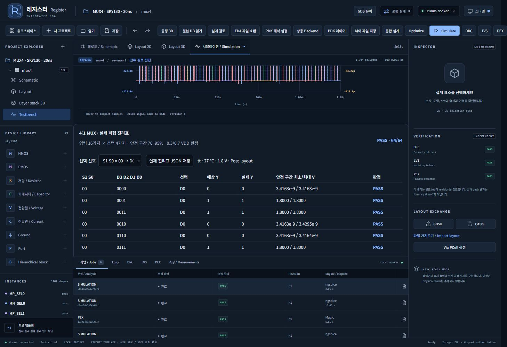
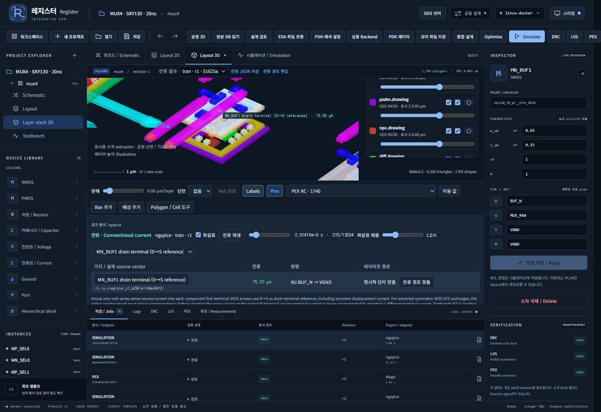
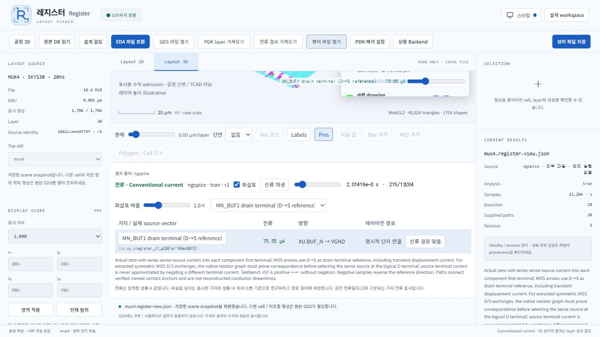

# 직접 툴을 사용해 제작한 4:1 MUX

## 0.13 새 배선과 독립 전류 뷰어

현재 `mux4.gds`, `mux4.oas`, `mux4.register.zip`, `mux4.register-view.json`은
gate/body 우회와 rail 범위·track 재사용을 적용하여 앱에서 새로 생성한 작업물입니다.
`../../docs/evidence/mux4-ui.json`의 실제 5개 run에서 pre/post 64/64와
DRC/LVS/PEX 통과, 저장·재개방 및 native export를 확인했습니다.

현재 독립 뷰어 파일은 1,724개 도형과 실제 signed current를 포함합니다.
`current-viewer-verification.json`에 실제 프로젝트/run·가지·샘플·수치를 기록했습니다.
`current-viewer-workflow.webm`은 3D 화살표·전류 샘플 선택·내보내기·엔진 요청 없는
독립 뷰어 재개방 작업입니다. 이전 수치·프로젝트와 5ns 실패 기록은 아래 설명 및
`../history/mux4-0.12/`의 자료입니다. 기존 설계와 실패를 자동 변경하지 않았습니다.

2026-10-02. 레지스터 화면의 **통합 설계 → MUX4 템플릿**을 실제로 실행하고,
Testbench 변경·프로젝트 복제·ngspice 해석·Magic DRC/PEX·Netgen LVS·PVT 실행·
GDS/OAS 내보내기·전류 슬라이더·저장 후 재개방을 직접 조작했습니다.
단순 회로 그림이나 합성 PASS 결과가 아닙니다. `verification.json`과 `native/`에
실제 작업별 결과·원시 파형·실행 manifest를 보존했습니다.

## 지금 열 수 있는 작업물

현재 로컬 워크스페이스에서 프로젝트를 검색해 **열기**를 누릅니다.

| 저장된 프로젝트 | 프로젝트 ID | 용도 |
|---|---|---|
| MUX4 · SKY130 · 20ns | `1042cceed4f74fc7b415dbc89aaba75e` | 기본 설계, revision 1 |
| MUX4 · SKY130 · 20ns copy | `a097014fa0fe4c3e92ab4a0336caaf97` | SS·고온·낮은 전압·큰 부하, revision 2 |
| MUX4 · 직접 설계 검증 | `98a3c0ddf6934002b8b3c99ffe126d9e` | 5ns 속도 경계와 pre-layout PVT 보존 |

`mux4.register.zip`은 설계·원본 OAS·PDK lock을 담은 Register 프로젝트 백업입니다.
worker의 `project.import_bundle`에 해당 파일 경로를 전달해 별도 프로젝트로 복원할 수 있습니다.
백업 형식은 해석 job을 포함하지 않으므로 결과는 아래 파일과 `native/`에서 확인합니다.

**Start-Viewer.cmd → 뷰어 파일 열기 → mux4.register-view.json**으로 Docker·로그인
없이 저장된 레이아웃과 실제 전류를 살펴볼 수 있습니다. 이 파일도 독립 뷰어에서
직접 다시 열어 **1,704개 형상·20개 단자 경로·13,284개 전류 샘플**을 확인했습니다.
샘플 214에서 MN_BUF1은 **75.5509184µA**, 기준 방향은 **BUF_N → VGND**입니다.
뷰어에서 이 파일을 열 때 새로운 해석을 실행하지는 않습니다.

표준 교환 파일은 `mux4.gds`, `mux4.oas`, `mux4.spice`입니다.
GDS/OAS를 KLayout으로 다시 읽어 원본 백업과 geometry hash 및 레이어별 polygon XOR가
일치하는 것까지 검사했습니다. SPICE에는 20개 MOS와 9개 포트가 들어 있습니다.

## 회로와 실제 검증

`Y = D[2×S1 + S0]`. 6개 transmission gate, 2개 선택 신호 inverter,
2개 출력 inverter를 사용하는 **NMOS 10개 + PMOS 10개** 회로입니다.
공개 SKY130A Magic PCell과 실제 모델을 사용하며 W=0.65µm, L=0.15µm입니다.
M1/M2 fanout과 M3 net rail을 사용한 넓은 기준 레이아웃입니다.

| 시험 | 조건 | 실제 결과 |
|---|---|---|
| 기본 pre-layout | TT, 27°C, 1.8V, 5fF, step 100ps, 입력 변경 20ns | 64/64 PASS |
| 기본 post-layout | 동일 조건, 배선 RC 포함 | 64/64 PASS |
| 느린 조건 pre-layout | SS, 125°C, 1.62V, 50fF, step 50ps, 입력 변경 20ns | 64/64 PASS |
| 느린 조건 post-layout | 동일 조건, 배선 RC 포함 | 64/64 PASS |
| 빠른 입력 pre-layout | TT, 27°C, 1.8V, 5fF, 입력 변경 5ns | 64/64 PASS |
| 빠른 입력 post-layout | 동일 조건, 배선 RC 포함 | **56/64 FAIL** |
| PVT 18점 | **5ns pre-layout만**, TT/SS/FF × −40/27/125°C × 1.62/1.8V | 18점 모두 64/64, 총 1,152개 조합 |
| 기본 물리 검증 | 공개 SKY130 deck | DRC 0개, LVS circuits match uniquely |
| 기본 PEX | Native Magic RC | R 1,509개, C 231개, 유한·비음수 값 |

데이터 16가지 × 선택 4가지의 모든 64개 조합을 Gray 순서로 구동합니다.
각 슬롯 85% 지점의 실제 입력과 출력, 70~95% 구간의 전체 출력 샘플을 검사합니다.
Low≤0.3VDD, High≥0.7VDD 기준이며, JSON 판정과 원시 `waveform.dat`를 별도로
대조해 기본·느린 조건·5ns 실패·PVT 18점의 결과를 확인했습니다.

기본 post-layout에서 측정한 최대 데이터 지연은 tPLH **4.834ns**, tPHL **3.284ns**입니다.
선택 신호가 고정된 단일 Gray 데이터 변화의 half-VDD 교차만 측정한 값입니다.
느린 조건에서는 tPLH **12.435ns**, tPHL **7.289ns**입니다.
20ns는 **입력 변경 간격**이며 STA 최대 clock이나 glitch-free 보증이 아닙니다.

## 사용하면서 수정한 기능

- 4:1 MUX 물리 템플릿, 64개 실제 진리표, 선택 신호별 필터와 JSON 저장을 추가했습니다.
- 반복 배치한 MOS 20개의 이름 있는 D/S 접점을 검사해 pre-layout 실제 전류 경로를 연결했습니다.
- PEX의 hierarchy 출력에서 나온 음수 C와 ngspice 문법 문제를 수정했습니다.
  `ext2spice hierarchy off`와 `format ngspice`를 사용하며,
  원시 R/C를 임의로 삭제하거나 음수 값을 clamp하지 않습니다.
  비유한·음수 R/C는 `pex-quality.json`에 기록하고 실패 처리합니다.
- 지원하는 해석 종류에 맞춰 네이티브 회귀 검사를 갱신했습니다. **27/27 PASS**,
  TypeScript/Vite/process build와 계약 테스트 **3/3 PASS**를 확인했습니다.

전체 UI Playwright 검사는 이번 직접 조작 이후 재실행하지 않았습니다.
현재 UI 증거는 직접 `cua_repl` 조작과 저장한 화면입니다. Windows 배포 EXE는 이번
변경으로 재패키징하지 않았고, 현재 로컬 개발 화면과 source에 적용되어 있습니다.

## 확인된 한계와 다음 개선

현재 넓은 기준 배선은 면적과 RC 지연을 최적화한 표준셀이 아닙니다. **5ns 실패**는
보존했으며, compact placement/routing과 drive sizing을 비교할 다음 기준점입니다.
전류 화살표는 실제 접점 사이의 **단자 기준 벡터**이며 공간 전류밀도 J나 도체 내부
streamline이 아닙니다. Post-layout의 반복 native MOS 이름과 D/S 대응은 아직 증명하지
못했으므로 해당 결과는 수치만 표시하며 물리 화살표를 임의로 만들지 않습니다.

다음 우선순위는 compact MUX layout/부하별 sizing, select glitch·hazard 및 STA,
post-layout MOS identity/D-S 대응, 계층 설계의 distributed RC 추출 검증,
작은 창에서의 EDA 교환 패널 높이 개선입니다. 이번 사용 중 작은 창에서 내보내기
버튼이 footer에 가려지는 문제를 확인해 작업 크기를 임시로 늘렸고, 완료 후 복원했습니다.

이번 MUX 시험에서 공정 TCAD·실측 coverage 보정·상용 도구 실행·인터넷 배포는
추가 검증하지 않았습니다. 공개 deck의 DRC/LVS 성공은 foundry 제조 signoff와 구분합니다.

## 증거 파일과 재검사

`mux4-pre.truth.json` / `mux4-post.truth.json`은 기본 20ns 결과입니다.
`stress-*.truth.json`은 각각 느린 조건과 5ns 결과이며, `.summary.json`에는 실제
조건·job ID·측정값이 있습니다. `native/`는 개별 작업의 SPICE, 파형, 로그와 manifest입니다.
`08a83d4f8ffc41dd801f716d72357964.pvt.json/.csv`는 실제 PVT export입니다.
`verification.json`에는 원본/표준 파일 해시, 원시 샘플 검사, 전류 대응과 source 해시가 있습니다.
`../mux4-evidence.zip`은 이 작업물을 묶은 압축 파일입니다. 용량이 큰 내부 노드 전체의
binary `waveform.raw`는 로컬 `native/`에 보존하고 압축 파일에서는 제외했습니다.
검사에 사용한 실제 `waveform.dat`·`current-flow.dat`, SPICE와 manifest는 포함합니다.

기존 EDA worker가 실행 중인 저장소 루트에서 파일만 읽어 재검사합니다.

```powershell
docker exec mos-studio-eda python /workspace/examples/mux4/verify_artifacts.py
```






