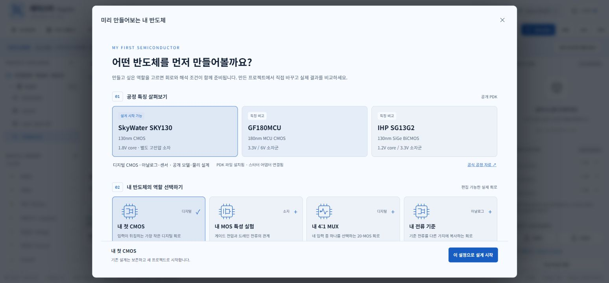
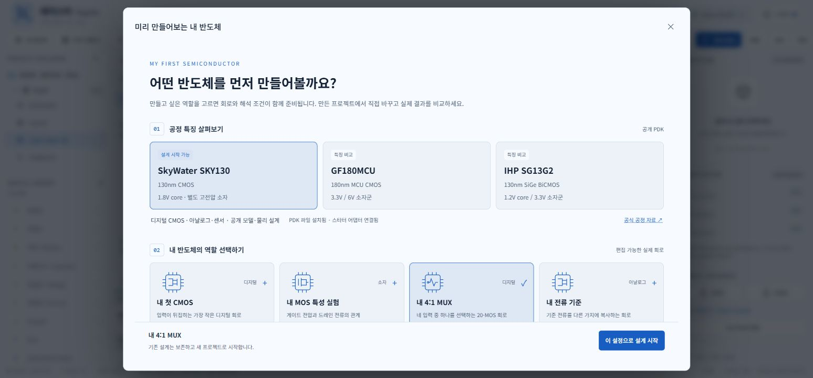
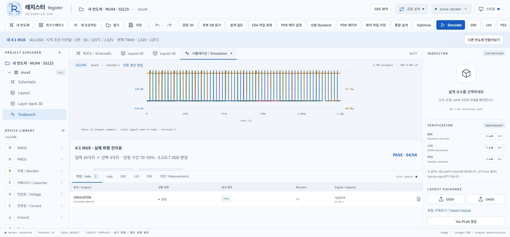
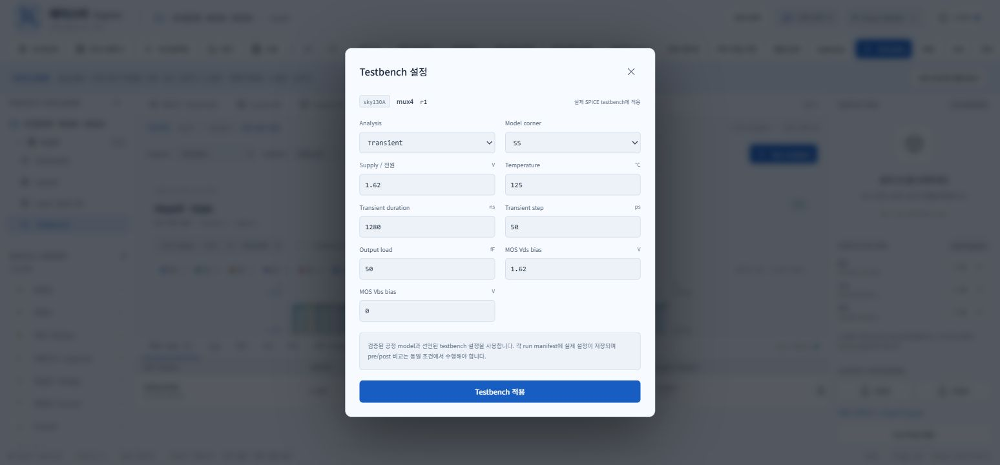

# 내 반도체 시작 설계 · 직접 사용 기록

2026-10-02. 로컬 브라우저의 **내 반도체** 화면을 직접 사용해 생성하고 실제 해석했습니다.

- 프로젝트: **내 반도체 · MUX4 · SS125**, `67f6658d2cd64f5c870147647f3080e6`, revision 1.
- 시작 설계: SKY130 20-MOS 4:1 MUX, 저전압·고온.
- 실제 설정: SS / 125°C / 1.62V / 50fF, transient 1280ns / 50ps.
- 실제 Run: `eb3e3de8ca09457097ab7451a4ad794c`, ngspice 완료, 64개 진리표 **64/64 PASS**.
- 화면의 저장 후 워크스페이스에서 다시 열고 testbench 값이 그대로 유지되는지 확인했습니다.

`saved-project.json`은 실제 저장된 회로와 설정입니다. `actual-run.json`은 파형 배열을
제외한 실제 Run 기록이며 `actual-truth-table.json`은 64개 판정입니다.
`manifest.json`, `testbench.spice`, `reference.spice`, `stdout.log`는 해당 작업의 원본
산출물 사본입니다. `artifact-receipt.json`에 파일 해시가 있습니다.
`read_saved_evidence.mjs`는 이 저장본만 읽고 검사하는 스크립트입니다.

이 프로젝트의 DRC·LVS·PEX는 이 시작 화면 검사에서 실행하지 않았습니다.
기존 물리 MUX의 pre/post·DRC·LVS·PEX 기록은 [MUX4 시험](../mux4/README.md)에 있습니다.
스타터 8개 전체의 조건별 해석과 첫 CMOS의 물리 검사는
[별도 native 엔진 검증](../../docs/evidence/semiconductor-starters-native.json)에 있습니다.

